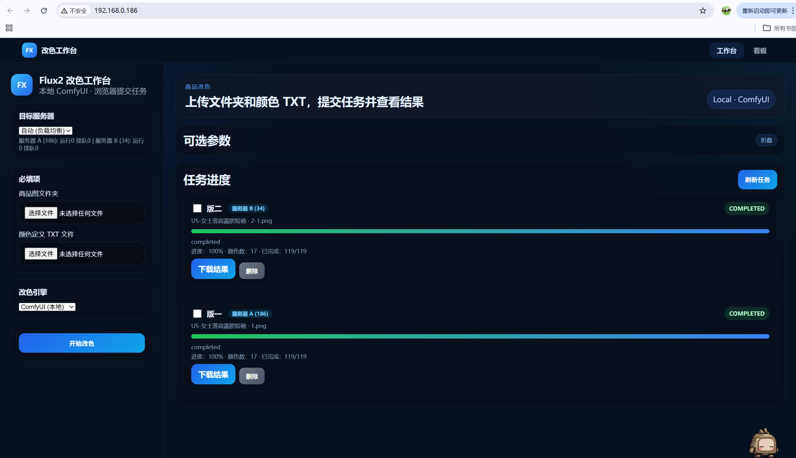
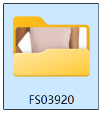
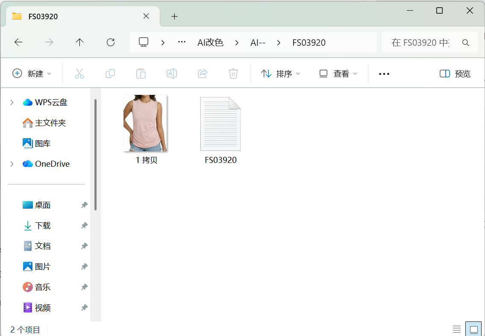
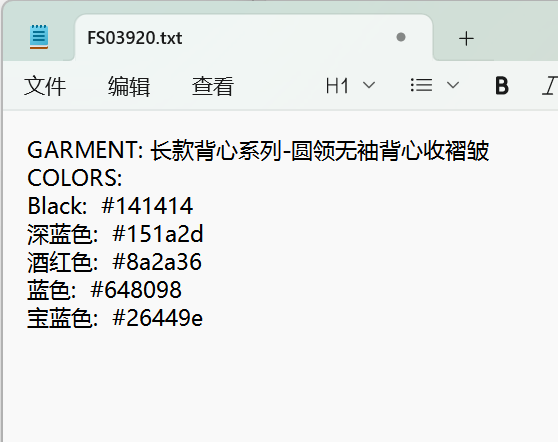
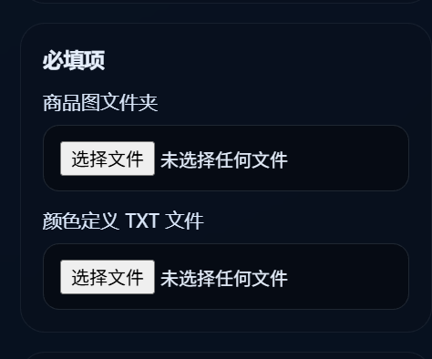

# AI 商品改色工作台使用手册

欢迎使用 AI 商品改色工作台。它可以根据指定颜色，批量生成商品图片的改色效果图，适合日常选色、上新配色和商品图初步出图使用。

## 1. 这个网站是做什么的

AI 商品改色工作台用于把同一款商品图批量改成多种指定颜色。

你准备两类文件：

- 商品图片文件夹：里面放需要改色的商品图。
- 颜色定义 TXT 文件：里面写商品名称和目标颜色。

网站会把每一张图片和每一个颜色组合起来生成结果。例如：

- 3 张商品图
- 5 个目标颜色

最终会生成大约 15 张改色结果图。

## 2. 使用前需要确认的事情

在使用前，请先连接公司网络。服务已经部署在公司内网，正常情况下你只需要打开浏览器访问：

```text
http://192.168.0.186/
```

如果无法打开页面，请先确认电脑是否已经连接公司网络，再联系维护人员检查服务状态。



页面顶部有两个入口：

- 工作台：上传图片和颜色文件，提交改色任务。
- 看板：查看所有任务的统计和明细。

## 3. 准备商品图片文件夹

### 3.1 文件夹命名

建议用商品编号作为文件夹名，例如：

```text
FS03920
```



这个文件夹名会成为任务里的“商品编号”，也会影响输出文件夹名称，方便后面找图。

### 3.2 图片放置规则

把同一款商品需要改色的图片都放进同一个文件夹。

示例：

```text
FS03920
  1.jpg
  2.jpg
  3.jpg
  FS03920.txt
```



网站选择图片时会读取这个文件夹里的图片文件。常见格式一般都可以使用，例如：

- JPG
- JPEG
- PNG
- WEBP

建议图片尽量满足：

- 主体商品清晰。
- 商品不要被大面积遮挡。
- 图片里不要有太多同色干扰物。
- 同一批图片尽量属于同一个商品。

## 4. 准备颜色定义 TXT 文件

颜色文件是一个普通 `.txt` 文本文件。推荐放在商品图片文件夹里，文件名和商品编号一致：

```text
FS03920.txt
```

### 4.1 标准格式

请按下面格式填写：

```text
GARMENT: 长款背心系列-圆领无袖背心收褶皱
COLORS:
Black: #141414
White: #f2f2f2
Pink: #e271a5
```



每一部分的含义：

- `GARMENT:` 后面写商品名称。
- `COLORS:` 表示下面开始写颜色。
- 每一行颜色使用“颜色名: 色值”的格式。
- 色值必须是 6 位 HEX 色号，例如 `#141414`。

### 4.2 中文颜色名也可以

可以写英文，也可以写中文：

```text
GARMENT: 圆领短袖T恤
COLORS:
黑色: #141414
浅灰色: #d8d8d8
湖蓝色: #36acb6
```

### 4.3 常见错误

不要写成 3 位色号：

```text
红色: #f00
```

应该写成 6 位：

```text
红色: #ff0000
```

不要漏掉 `COLORS:`，否则系统找不到颜色。

不要把颜色值写成 RGB、CMYK、潘通号或中文描述。当前工具识别的是 HEX 色号。

## 5. 提交改色任务

### 5.1 打开工作台

打开浏览器，进入工作台页面：

```text
http://192.168.0.186/
```

访问前请确保电脑已经连接公司网络。

### 5.2 选择目标服务器

左侧有“目标服务器”选择框：

- 自动：系统会在配置的服务器中选择负载较低的一台。
- 服务器 A / 服务器 B：手动指定某台服务器。

如果你不确定选哪个，保持“自动”即可。

### 5.3 上传商品图文件夹

在“必填项”里点击“商品图文件夹”，选择准备好的商品文件夹。



注意：

- 请选择文件夹，不是单独选一张图。
- 文件夹里必须有图片。
- 文件夹名最好是商品编号。

### 5.4 上传颜色定义 TXT 文件

点击“颜色定义 TXT 文件”，选择刚才准备的 `.txt` 文件。

### 5.5 选择改色引擎

页面里有“改色引擎”：

- ComfyUI（本地）：使用本地 ComfyUI 工作流生成，适合内网、本机或固定工作站。
- Cloud API（云端）：使用云端图片生成接口，需要维护人员配置 API Key。

如果维护人员没有特别说明，优先使用默认选项。

### 5.6 开始改色

确认图片文件夹和 TXT 文件都已选择后，点击“开始改色”。

提交成功后，任务会出现在“任务进度”区域。任务状态会自动刷新。

## 6. 可选参数怎么用

页面中有“可选参数”，默认是折叠的。一般情况下不需要改。

### 6.1 商品名称

如果 TXT 文件里的 `GARMENT:` 写得不够准确，可以在这里手动填写商品名称。

商品名称会影响 AI 判断要改哪一类衣服。建议写清楚品类，例如：

- 圆领短袖T恤
- 高腰牛仔裤
- 吊带连衣裙
- 长款背心

### 6.2 Guidance

控制 AI 对提示词的遵循程度。默认是：

```text
3.5
```

设计人员通常不用改。

如果结果颜色不够接近目标色，可以让维护人员一起评估是否调整。

### 6.3 Steps

生成步数。默认是：

```text
20
```

步数越高，通常生成更慢。不要随意调得过高。

### 6.4 8-step Steps

用于工作流里的 8-step 相关节点。默认是：

```text
8
```

通常不用改。

### 6.5 目标宽度和目标高度

默认尺寸：

```text
宽度：1601
高度：2086
```

这个尺寸会影响生成图的输出比例和大小。一般按项目默认值使用。

### 6.6 手动颜色

如果你想临时补充颜色，可以在“手动颜色”里填写：

```text
粉色: #e271a5
湖蓝色: #36acb6
```

这些颜色会追加到 TXT 文件里的颜色后面，一起生成。

注意：如果手动颜色和 TXT 里的颜色重复，系统不会自动帮你去重。

### 6.7 提示词模板

这里可以自定义 AI 改色提示词。完全没有经验时建议留空。

留空时系统会自动使用默认模板，并根据商品名称判断类型：

- top：上衣类
- bottom：裤装、半身裙类
- dress：连衣裙类

模板里可以使用变量：

```text
{GARMENT}
{GARMENT_CATEGORY}
{RGB_VALUE}
{HEX_VALUE}
```

例如：

```text
Recolor the {GARMENT} to {RGB_VALUE} ({HEX_VALUE}). Keep the model, background, fabric texture, seams and shape unchanged.
```

如果不熟悉英文提示词，不建议修改这里。

## 7. 查看任务状态

任务区域会显示每个任务的状态：

- `queued`：排队中。
- `running`：正在生成。
- `completed`：已完成。
- `failed`：失败。
- `cancelled`：已取消。
- `paused`：服务中断后暂停，可尝试恢复。
- `cancelling`：正在取消。

每个任务会显示：

- 商品编号或任务 ID。
- 商品名称。
- 当前状态。
- 进度条。
- 颜色数量。
- 已完成数量。
- 操作按钮。

页面大约每 3 秒自动刷新一次。

## 8. 下载结果

当任务状态变成 `completed` 后，任务卡片里会出现“下载结果”按钮。

点击后会下载一个 ZIP 压缩包。

结果图片命名通常包含：

- 原图文件名。
- 颜色名。
- HEX 色号。
- 序号。

示例：

```text
1_Black_#141414_1.png
```

服务端也会把结果保存在：

```text
storage/outputs/商品编号/
```

如果你只是日常使用网站，不需要打开这个目录，直接在网页下载即可。

## 9. 取消、恢复和删除任务

### 9.1 取消任务

排队中或运行中的任务可以点击“取消任务”。

取消后，已经生成完成的部分结果可能会保留，但未完成的组合不会继续生成。

### 9.2 恢复任务

失败、暂停或已取消的任务，如果已经有部分完成记录，页面会显示“恢复任务”。

恢复后系统会跳过已完成的图片和颜色组合，只继续处理剩余部分。

注意：如果原始上传图片已经被删除，恢复会失败。

### 9.3 删除任务

已完成、失败、暂停或已取消的任务可以删除。

删除会移除任务记录，并清理对应的输出文件夹。正在运行或排队的任务不能直接删除，需要先取消。

### 9.4 批量删除

勾选多个任务后，可以使用“删除选中”。

正在运行或排队的任务会被跳过，不会被删除。

## 10. 使用看板

点击顶部“看板”可以查看统计页面。

看板包含：

- 商品总数。
- 已完成任务数。
- 进行中任务数。
- 失败或暂停任务数。
- 总改色组合数。
- 完成率。
- 已取消任务数。
- 任务状态分布图。
- 引擎使用分布图。
- 最近 7 天提交量。
- 任务明细表。

看板支持：

- 搜索商品编号或商品名称。
- 按状态筛选任务。
- 自动刷新数据。

## 11. 推荐的日常工作流程

1. 新建商品编号文件夹。
2. 把这款商品所有要改色的图片放进文件夹。
3. 在同一文件夹里准备颜色 TXT 文件。
4. 打开网站工作台。
5. 选择商品图文件夹。
6. 选择颜色 TXT 文件。
7. 保持默认参数，点击“开始改色”。
8. 等任务完成。
9. 下载 ZIP。
10. 检查生成图是否符合设计要求。
11. 对不满意的颜色或图片单独重跑。

## 12. 图片结果不理想时怎么办

### 12.1 改错了衣服

可能原因：

- 商品名称太模糊。
- 图片里有多个相似服装。
- 商品类别判断错误。

可以尝试：

- 在“商品名称”里写得更具体。
- 例如把“裙子”改成“吊带连衣裙”或“半身裙”。
- 减少图片里无关商品的干扰。

### 12.2 背景或人物被改了

可以尝试：

- 使用更清晰的商品主图。
- 避免背景颜色和衣服颜色过于接近。
- 联系维护人员优化提示词模板。

### 12.3 颜色不够准

可以尝试：

- 检查 HEX 色号是否正确。
- 确认色号是 6 位。
- 对特别浅、特别深、荧光色或高饱和色，预期要适当放宽，因为 AI 会保留布料光影。

### 12.4 细节被重画了

可以尝试：

- 换更清晰的原图。
- 避免使用过小或压缩严重的图片。
- 使用默认提示词，不要写过于开放的自定义提示词。

## 13. 常见报错和处理方式

### 13.1 “请先选择商品图文件夹”

没有选择图片文件夹。重新点击“商品图文件夹”并选择文件夹。

### 13.2 “文件夹里没有可用图片”

文件夹里没有浏览器能识别的图片文件。请确认图片格式是否正确。

### 13.3 “请上传颜色定义 TXT 文件”

没有选择颜色 TXT 文件。请选择 `.txt` 文件。

### 13.4 “No colors found”

颜色文件里没有识别到颜色。

检查：

- 是否有 `COLORS:`。
- 颜色是否写在 `COLORS:` 后面。
- 色号是否为 6 位 HEX。

### 13.5 “无法连接”或服务器离线

当前服务器没有启动，或网络无法访问。

处理方式：

- 切换目标服务器。
- 刷新页面。
- 联系维护人员检查服务。

### 13.6 任务长时间没有进度

可能原因：

- 前面还有任务排队。
- ComfyUI 正在生成，单张图耗时较长。
- 图片数量和颜色数量太多。
- 服务或显卡资源不足。

可以先等待几分钟，再刷新页面或查看看板。

## 14. 文件管理建议

建议设计团队按商品编号整理：

```text
商品改色/
  FS03920/
    1.jpg
    2.jpg
    FS03920.txt
  FS03921/
    1.jpg
    2.jpg
    FS03921.txt
```

颜色文件建议保留在商品文件夹内，方便以后重新生成。

输出 ZIP 下载后，建议按日期或批次保存：

```text
改色结果/
  2026-05-09/
    FS03920.zip
    FS03921.zip
```

## 15. 给设计人员的质量检查清单

下载结果后，建议逐张检查：

- 颜色是否接近目标色。
- 商品结构是否保持原样。
- 领口、袖口、腰头、口袋、褶皱等细节是否被改坏。
- 模特皮肤、头发、背景是否没有明显变化。
- 图片是否有异常边缘、涂抹感、塑料感或多余线条。
- 同一款商品不同角度的颜色是否基本一致。

如果某些图不合格，可以只把对应图片和颜色重新提交，不必整批重跑。
